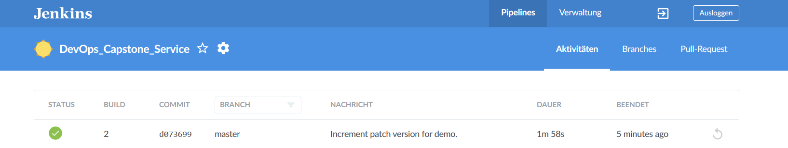
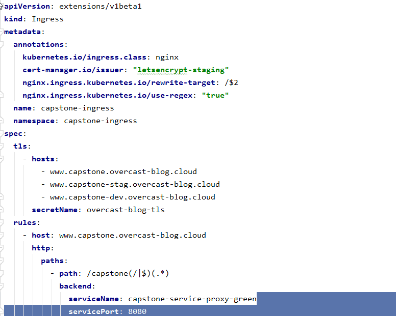

# Repository Overview

This is the main repository for the [Udacity Cloud DevOps Nano Degree](https://www.udacity.com/course/cloud-dev-ops-nanodegree--nd9991).
It contains the documentation and infrastructure setup for the final (capstone) project.

This includes
* Code for setting up infrastructure
  - [AWS EKS](https://aws.amazon.com/de/eks/) cluster setup using [eksctl](https://github.com/weaveworks/eksctl) and shell scripts
  - Scripts for preparing the EKS cluster for [GitOps](https://www.weave.works/technologies/gitops/) using [Flux](https://www.weave.works/oss/flux/) 
  and [Helm](https://helm.sh/)
* Documentation

There are three other repositories 
* [DevOps_Capstone_Deployment](https://github.com/FlorianSeidel/DevOps_Capstone_Deployment):  Contains the Flux deployment config
* [DevOps_Capstone_Service](https://github.com/FlorianSeidel/DevOps_Capstone_Service): Contains a Quarkus toy micro-service and the Jenkins pipeline
* [DevOps_Capstone_Repo](https://github.com/FlorianSeidel/DevOps_Capstone_Repo): Helm Repository for the project


# Project Overview

This is a toy CI/CD setup for delivering code changes into a production environment in an automated way.
It is based on Jenkins, AWS EKS, eksctl, Helm, Flux, GitHub, DockerHub and Quarkus.
Infrastructure setup and configuration is completely automated. 

The project contains the following parts:
- A simple toy micro-service built using the [Quarkus](https://quarkus.io/) framework.
- A K8s integrated, Helm based Jenkins setup, configured as code using [Jenkins Configuration As Code](https://jenkins.io/projects/jcasc/) and deployed using GitOps.
- A multi-branch Jenkins pipeline for the toy project, configured using the [Jenkins Jobs DSL](https://jenkinsci.github.io/job-dsl-plugin/).
- A development workflow definition, including branching model (trunk based development), partly enforced by the Jenkinsfile.
- A AWS EKS K8s cluster setup with development, staging and production environments, configured for Blue/Green deployments controlled by Flux. 

See the DevOps_Capstone_Deployment and DevOps_Capstone_Service repos for more details.

#### Future Plans

- Have a look at security. Currently only the bare minimum has been done.
- Secure the Tiller deployment
- Use spot instances to save cost
- Add test automation after deployment
- Make cluster auto-scaling work
- Build native image with Quarkus
- Use Helm Chart repo for release
~~- Configure and test HPA for service~~
- Add Keycloak for identity managment
- Integrate Jenkins with Keycloak
- Integrate Service with Keycloak
- Use ALB instead of NGINX ingress
- Use AWS Cognito as identity provider
- Use Route53 plugin to create A records automatically. 
- Perform security scanning of the Docker containers
- Replace NAT Gateways with NAT instances to save costs
- Figure out why the NLB has all nodes in target group
- Use Terraform to build the EKS cluster
- Configure HPA for the Ingress Controller
- Add a second instance of the Ingress Controller running on a different node
- ~~Make setup more generic by adding parameters. Currently GitHub and DockerHub accounts are hard-coded.~~
- Split Flux deployment config into CI/CD and service deployment
- FaaS on Kubernetes
- Add additional services
- Integrate Kafka, MonogDB and Redis

# Architecture 

## Delivery Pipeline


## EKS Cluster


# Setup

1. Fork the repository
2. Run ```./setup/jenkins/build-jenkins-slave.sh $dh_user```. Where $dh_user is your DockerHub account name. This will push the image to $dh_user/capstone-build-slave:latest.
3. Run ```./setup/configure-eks-cluster.sh $gh_user $gh_pass $gh_token $dh_user $dh_pass```.
Where $*_user and $*_pass are the GitHub and DockerHub credentials. $gh_token is a GitHub access token.


# Example Blue/Green deployment

The following is an example blue/green deployment. All steps are listed with relevant screenshots.

### Initial State
- Version 1.1.2 is deployed in namespace capstone-prod-green
- Version 1.2.0 is deployed in namespcae capstone-prod-blue
- Ingress routes www.capsone.overcast-blog.cloud to capstone-prod-blue


Desired final state
- Version 1.2.1 is deployed in namespace capstone-prod-green
- Version 1.2.0 is deployed in namespcae capstone-prod-blue
- Ingress routes www.capsone.overcast-blog.cloud to capstone-prod-green

### Master build and deployment

Version is incremented to 1.2.1 on the master branch.


Commit and push to master branch.


Master builds commit successfully.



Dockerfile linting using Hadolint container.


Here is an example of a failed linting step.


Helm chart linting.


Build and push docker image.


Latest master branch image is automatically deployed by Flux.


### Automated deployment of release branch to staging environment

Create release branch.


Successful build of release branch. Docker image with tag 1.2.1 pushed.


Image is deployed to capstone-stag namespace.


Here is the history of image tags and which are deployed currently.


### Blue/Green deployment to production namespace

First, the image tag is updated in the green environment. 


Then, the ingress rule is modified to route traffic to the capstone-green namespace.



Finally, after commiting and pushing. The www.capstone.overcast-blog.cloud is routed to the new deployment.


